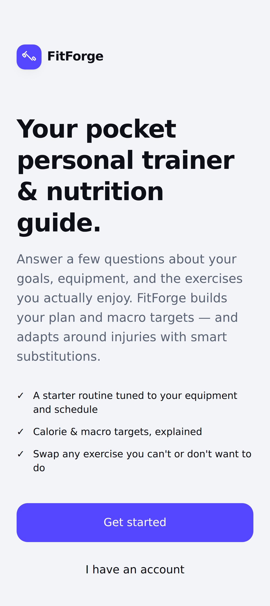
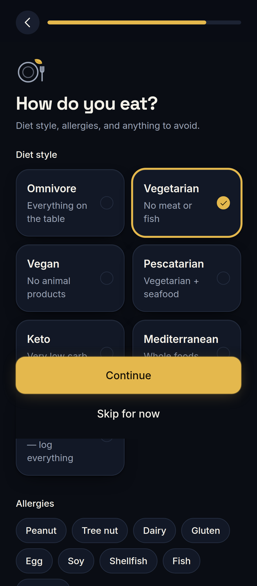
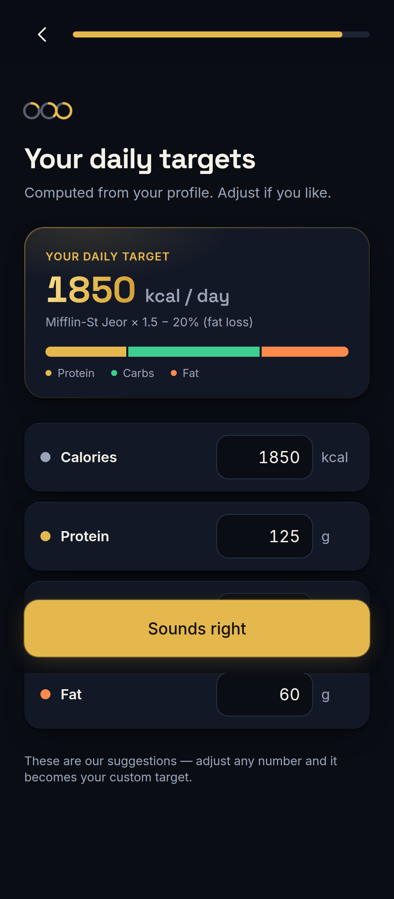
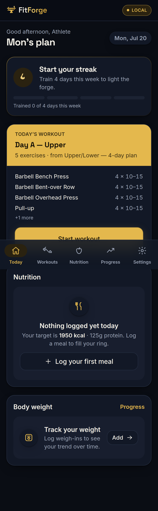
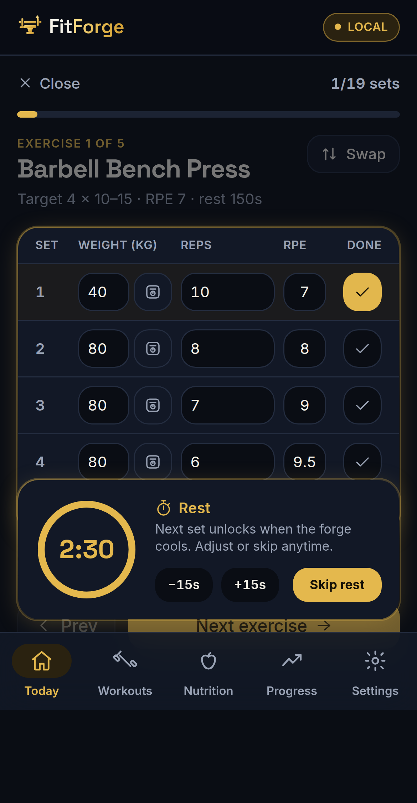
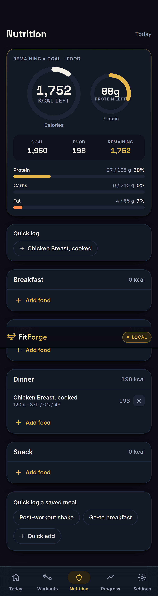
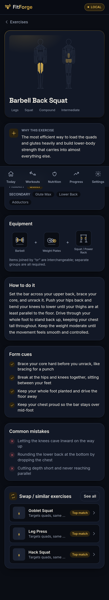
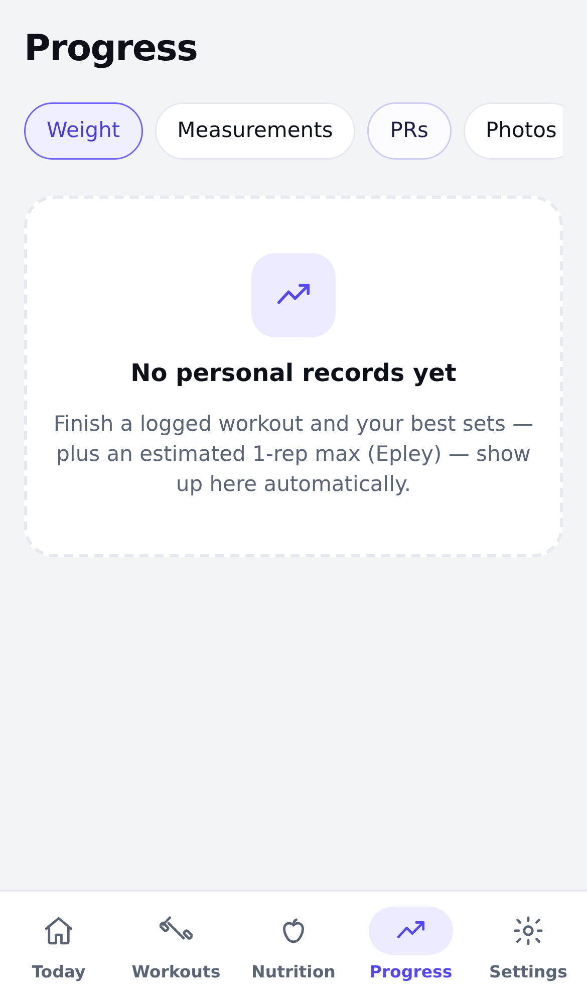
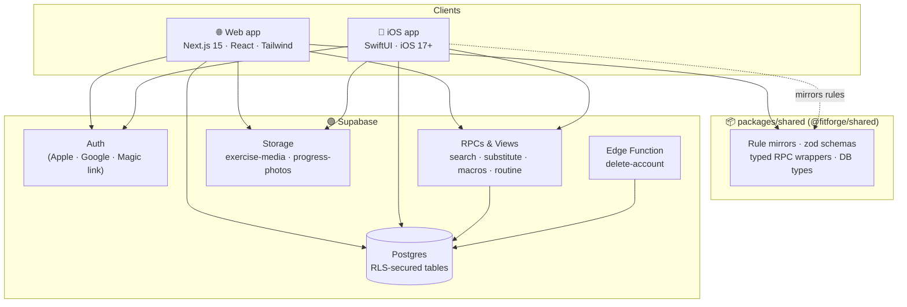

<div align="center">

# 🏋️ FitForge

### Forge your training. Fuel your body.

**A modern, mobile-first personal trainer & nutrition guide** — built preference-first, so the plan is shaped around *your* equipment, the movements you love, and the ones you'd rather never do again.

[](./LICENSE)
[](./apps/web)
[](./apps/ios)
[](./supabase)
[](./turbo.json)

[**🚀 Live demo → girnarholdings.github.io/FitForge**](https://girnarholdings.github.io/FitForge/)

</div>

---

## 🚀 Live demo

A fully interactive, **backend-free demo** of the web app is deployed to GitHub Pages:

### **→ [girnarholdings.github.io/FitForge](https://girnarholdings.github.io/FitForge/)**

Runs entirely in your browser in **Local Mode** (gold-on-dark "Forged Gold" theme) — it uses the app's real deterministic rules (`@fitforge/shared`) and curated catalog, with data-driven **muscle-anatomy maps**, illustrated equipment, and a weekly volume heatmap. **Start in Local Mode → complete onboarding → get a generated plan → explore Today, Workouts, Nutrition, Exercises, and Progress.** No sign-up, no backend; export/import your data anytime. (The production build swaps this local layer for Supabase auth + Postgres.)

> Every screen below is covered by the Playwright end-to-end suite (`apps/web/tests/e2e/`, **18 tests**) — the screenshots are captured by those tests on each run.

|  |  |  |
|:--:|:--:|:--:|
|  |  |  |
| **Landing** | **Preference onboarding** | **Computed macro targets** |
|  |  |  |
| **Today — generated plan** | **Workout player** | **Nutrition logging** |
|  |  | |
| **Exercise + substitutions** | **Progress** | |

---

## ✨ Why FitForge

Most fitness apps hand you a generic plan and hope it sticks. FitForge starts the other way around: a fast, delightful **onboarding that learns your preferences** and forges a profile that everything else is built on.

- **🎛️ Preference-driven onboarding.** Tell us what equipment you have, which exercises you enjoy, and what to exclude or swap. Every field is **auto-filled or predicted** — type-ahead search over a curated catalog, smart defaults per goal + experience, and sensible presets — so your profile forms cleanly without a wall of empty forms.
- **🔁 Equipment-aware substitution.** Excluded an exercise or don't own the machine? FitForge deterministically finds the best equivalent for the *same muscle and movement pattern* using only the gear you actually have.
- **📱 Genuinely mobile-first.** Designed for the iPhone in your hand at the gym — a native **SwiftUI** app and a responsive **Next.js** web app, both talking to the same backend.
- **🥗 Nutrition that matches the training.** Macro targets from your metrics + goal (Mifflin–St Jeor), a curated food database, and fast daily logging.
- **📈 Progress you can see.** Personal records, body metrics, and progress photos — with snapshot-on-log history so your data stays true even as the catalog evolves.

> **Learned from [wger](https://github.com/wger-project/wger), rebuilt for mobile.** FitForge is *not* a wger fork. We studied wger's excellent open-source domain model (exercises, muscles, equipment, routines, nutrition) and re-designed it on a modern stack with a cleaner data model and a preference-first UX. See [`docs/decisions/`](./docs/decisions) for the design record.

---

## 🧠 The intelligence layer (no LLM required)

FitForge's "smart" onboarding is **deterministic** — fast, offline-friendly, explainable, and free to run. It lives in Postgres functions and is mirrored in TypeScript for instant client-side previews.

| Capability | How it works |
|---|---|
| **Type-ahead search** | `pg_trgm` fuzzy match + a popularity/prefix ranking score |
| **Smart defaults** | Goal × experience matrices → sets, reps, rest, weekly frequency |
| **Macro targets** | Mifflin–St Jeor BMR → TDEE → goal-adjusted calories + macro split |
| **Exercise substitution** | 6-step scoring over movement pattern, target muscle & available equipment |
| **Starter routine** | Role-slot split templates chosen by frequency + preferences |

The architecture leaves a clean seam to layer an **AI assist** on later — but the MVP ships without it.

---

## 🏗️ Architecture



Both clients hit the **same Supabase-backed REST API** (PostgREST) and the same RPC "intelligence" functions. Row Level Security isolates every user's data; catalog data is world-readable.

---

## 🗂️ Monorepo map

```
fitforge/
├── apps/
│   ├── web/            # Next.js 15 App Router — marketing, auth, 13-step onboarding, app shell
│   └── ios/            # SwiftUI app (XcodeGen) — onboarding + Today/Workout/Nutrition/Progress
├── packages/
│   └── shared/         # @fitforge/shared — DB types, zod schemas, rule mirrors, typed RPCs
├── seed/               # Curated content (equipment, muscles, exercises, foods) + generator
├── supabase/
│   ├── migrations/     # 0001–0004 schema + RLS, 0005 views & RPCs
│   ├── functions/      # Edge Functions (delete-account)
│   ├── seed/seed.sql   # Generated seed artifact
│   └── tests/          # pgTAP suites (schema + RPC)
└── docs/               # Blueprint, architecture, API, onboarding spec, ADRs
```

| Package | What's inside |
|---|---|
| [`apps/web`](./apps/web) | Next.js 15, Tailwind, Supabase SSR auth, a mobile-first design system, and the full 13-screen onboarding |
| [`apps/ios`](./apps/ios) | Native SwiftUI (iOS 17+), `supabase-swift`, Sign in with Apple, Swift Charts, XcodeGen project |
| [`packages/shared`](./packages/shared) | The single TypeScript contract: DB types, zod validation, and pure-TS mirrors of every rule |
| [`seed`](./seed) | 30 equipment · 20 muscles · 9 categories · 48+ exercises · 32 foods · curated substitution graph |
| [`supabase`](./supabase) | Schema, RLS, RPCs, storage buckets, and pgTAP tests |

---

## 🚀 Quick start

**Prerequisites:** Node ≥ 20, npm ≥ 10, [Supabase CLI](https://supabase.com/docs/guides/cli), Docker (for the local stack). For iOS: macOS + Xcode 15+ and [XcodeGen](https://github.com/yonaskolb/XcodeGen).

```bash
# 1. Install workspace dependencies
npm install

# 2. Build the shared package (web + tooling depend on its build output)
npm run build -w @fitforge/shared

# 3. (Re)generate the seed SQL from the curated JSON — optional; artifact is committed
npm run seed:generate

# 4. Boot the local Supabase stack, then apply migrations 0001–0005 + load the seed
npm run db:start
npm run db:reset

# 5. Configure web env
cp .env.example apps/web/.env.local   # fill NEXT_PUBLIC_SUPABASE_URL / _ANON_KEY from `supabase start` output

# 6. Run the web app
npm run dev            # → http://localhost:3000
```

**iOS:**

```bash
cd apps/ios
xcodegen generate
open FitForge.xcodeproj      # set your Supabase URL/anon key in the app config, then ⌘R
```

**Handy scripts:**

```bash
npm run test          # all unit tests (turbo)
npm run seed:check    # validate curated data (referential integrity + macro sanity)
npm run db:test       # pgTAP schema + RPC suites
npm run lint          # lint across workspaces
```

---

## 🧭 The onboarding flow

A 13-screen state machine that fills your profile with as little typing as possible. Each step persists write-through, so you can resume anytime.


Full behavior — including per-screen autofill rules — lives in [`docs/onboarding-spec.md`](./docs/onboarding-spec.md).

---

## 🧪 Project status

This is an **MVP scaffold** generated as a coherent, buildable foundation. A few integration follow-ups are tracked in [`docs/BUILD-MANIFEST.md`](./docs/BUILD-MANIFEST.md):

- Swap WS-5's temporary UI stubs for the shared `components/ui` primitives.
- Wire the remaining live data paths (workout-session creation, photo upload, plan regeneration).
- Regenerate `packages/shared/src/types/database.ts` via `supabase gen types` once the stack is up.
- Run the full local stack end-to-end and build iOS on a Mac.

Contributions welcome — see [`CONTRIBUTING.md`](./CONTRIBUTING.md).

---

## 📚 Documentation

| Doc | Purpose |
|---|---|
| [`docs/BLUEPRINT.md`](./docs/BLUEPRINT.md) | The authoritative design blueprint (product, schema, rules, seed) |
| [`docs/architecture.md`](./docs/architecture.md) | Condensed architecture & data model overview |
| [`docs/onboarding-spec.md`](./docs/onboarding-spec.md) | The onboarding flow + deterministic rule specs |
| [`docs/api.md`](./docs/api.md) | REST resources, views, and RPC surface |
| [`docs/decisions/`](./docs/decisions) | Architecture Decision Records |
| [`docs/BUILD-MANIFEST.md`](./docs/BUILD-MANIFEST.md) | Build record + integration follow-ups |

---

## 📄 License

FitForge is released under the **[Creative Commons Attribution-ShareAlike 4.0 International](./LICENSE)** license (CC BY-SA 4.0).

> ℹ️ **Note:** Creative Commons licenses are designed for creative and content works and are *unusual for source code*. We use CC BY-SA 4.0 here by project preference for the whole repository (code, curated data, and docs). Third-party dependencies retain their own licenses. If you plan to build commercially on this code, review CC BY-SA's ShareAlike obligations carefully.

---

<div align="center">

*Built with a Fable-led research prewalk and a fleet of parallel build agents.* 🤖

</div>
