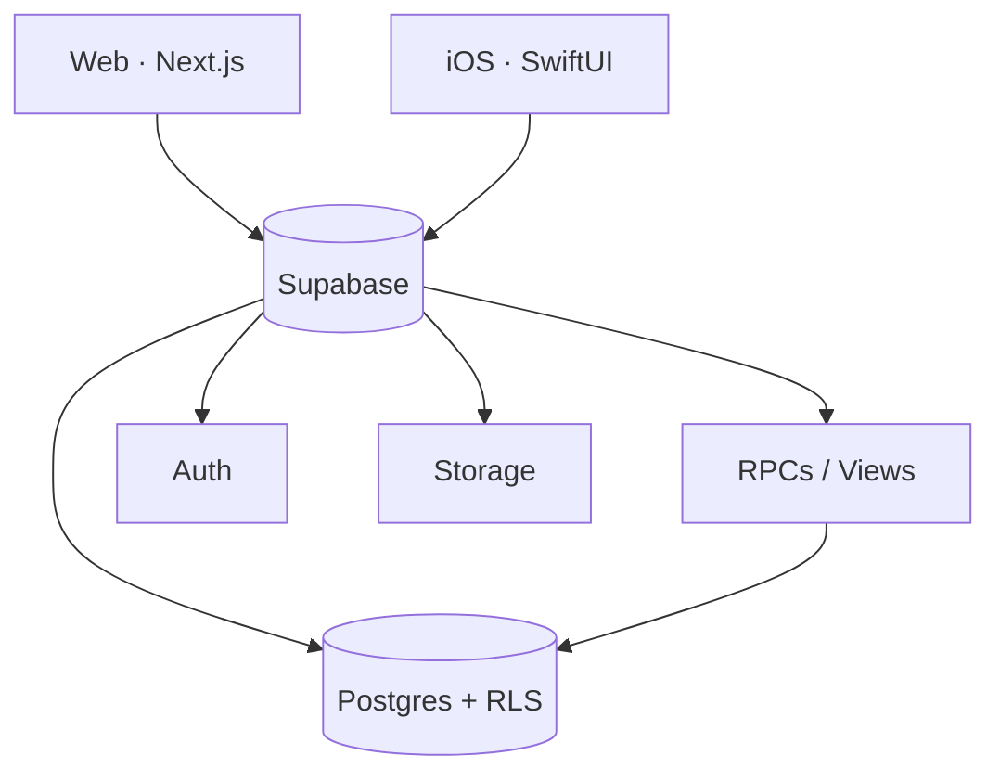

# FitForge — Architecture

> Condensed from [`BLUEPRINT.md`](./BLUEPRINT.md) §1, §3, §5. The blueprint is authoritative.

## Overview

FitForge is a mobile-first personal-trainer + nutrition-guide product. Two clients — a **Next.js web app** and a **native SwiftUI iOS app** — share one backend: **Supabase** (Postgres + Auth + Row Level Security + PostgREST + Storage + Edge Functions).

The product's differentiator is a **preference-driven onboarding** that builds a rich user profile with heavy autofill/prediction, powered by a **curated catalog** and a **deterministic rules engine** (no LLM in the MVP).

## Principles

1. **Mobile-first** — every screen is designed for a phone first (≤430px), then scaled up.
2. **Preference-first** — the profile is the product; onboarding is the centerpiece.
3. **Deterministic intelligence** — explainable, fast, offline-friendly rules over black-box models.
4. **One contract** — `packages/shared` and the database schema are the shared truth for both clients.
5. **Snapshot on log** — logged sets/meals capture their values at log time, immune to later catalog edits.
6. **Secure by default** — user data is RLS-isolated; catalog data is world-readable.

## Data model (plane summary)

The schema splits into two planes (full DDL in `supabase/migrations/0001–0004`):

### Catalog plane (world-readable)
- `muscle_groups`, `muscles` — taxonomy with primary/secondary relationships.
- `equipment` — ~30 items with alt-group semantics (OR within a group, AND across groups).
- `exercise_categories`, `exercises` — the exercise catalog with movement pattern, mechanics, difficulty, popularity.
- `exercise_muscles`, `exercise_equipment` — M2M links (primary/secondary muscles; equipment requirements).
- `exercise_substitutions` — a directed substitution graph with similarity scores.
- `foods` — ~32 items with per-100g macros, serving sizes, diet + allergen tags.

### User plane (RLS owner-only)
- `profiles` — goal, experience, metrics, onboarding progress.
- `user_equipment`, `user_liked_exercises`, `user_excluded_exercises`, `user_substitutions` — preferences.
- `routines`, `routine_days`, `routine_exercises` — the plan (with one-active-routine constraint).
- `workout_sessions`, `set_logs` — training history (snapshot-on-log).
- `meals`, `meal_items`, nutrition targets — nutrition logging.
- `body_metrics`, progress photos — progress tracking.

## Backend surface

- **PostgREST** exposes tables directly under RLS for straightforward CRUD.
- **Views** (`v_daily_nutrition`, `v_exercise_full`, `v_exercise_prs`) provide read models with `security_invoker=true`.
- **RPCs** implement the intelligence layer (search, substitution, macros, routine generation, logging helpers).
- **Storage** buckets: `exercise-media` (public), `progress-photos` (private, owner-only).
- **Edge Function** `delete-account` performs full account teardown.

See [`api.md`](./api.md) for the full endpoint/RPC list.

## Client architecture

- **Web** (`apps/web`): App Router with route groups — `(marketing)`, `(auth)`, `onboarding/[step]`, `(app)`. Supabase SSR auth via middleware guards. A mobile-first design system in `components/ui`.
- **iOS** (`apps/ios`): SwiftUI (iOS 17+), `supabase-swift`, repository pattern (protocol + live + preview mocks), Swift Charts, Sign in with Apple.
- **Shared** (`packages/shared`): DB types, zod schemas, pure-TS mirrors of every rule (so the web client can preview results instantly before the authoritative RPC call), and typed RPC wrappers.
